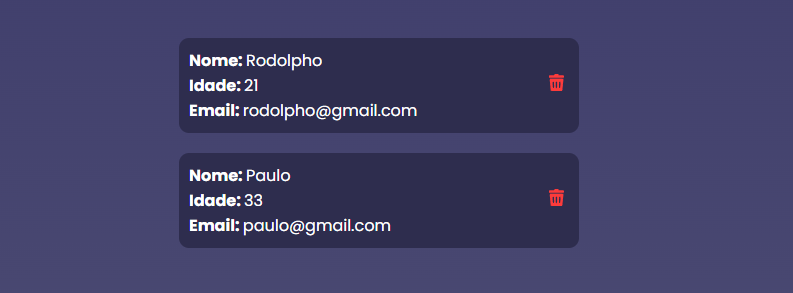

# Cadastro de Usuários

Projeto para cadastrar informações de usuários usando uma API conectada a um banco MongoDB. Permite adicionar e excluir usuários, exibindo-os em cards abaixo do formulário.

## Tecnologias

- React (com Vite)  
- CSS  
- API em JavaScript com Axios  
- MongoDB  
- Hospedagem: Frontend no Vercel e API no Firebase  

## Demonstração


*Formulário para cadastro de usuários.*

  
*Usuários exibidos em cards com opção de exclusão.*

## Como usar

1. Acesse o link do projeto hospedado (forneça o link aqui).  
2. Preencha o formulário com nome, idade e email.  
3. Clique em "Registrar".  
4. Após o cadastro, o usuário aparece em um card abaixo do formulário.  
5. É possível cadastrar múltiplos usuários, porém emails repetidos não são permitidos.  
6. Para excluir um usuário, use o botão de exclusão no card correspondente.

> Observação: o cadastro pode demorar um pouco devido ao uso da API.

## Exemplo de código

```jsx
// Exemplo do componente de formulário de cadastro
import { useEffect, useState, useRef } from "react";
import "./style.css";
import Trash from "../../assets/trash.svg";
import api from "../../services/api";

export default function Home() {

  const [ users, setUsers ] = useState([])

  const inputName = useRef()
  const inputAge = useRef()
  const inputEmail = useRef()

  async function getUsers() {
    const usersFromApi = await api.get('/usuarios')

    setUsers(usersFromApi.data)
  }

  async function createUsers() {
    await api.post('/usuarios', {
      name: inputName.current.value,
      age: inputAge.current.value,
      email: inputEmail.current.value
    })

    getUsers()
  }

  async function deleteUsers(id) {
    await api.delete(`/usuarios/${id}`)

    getUsers()
  }

  useEffect(() => {
    getUsers()
  }, [])

  return (
    <div className="container">

      <form action="">
        <h1>Cadastro de Usuários</h1>
        <input name="name" type="text" placeholder="Nome" ref={inputName}/>
        <input name="age" type="number" placeholder="Idade" ref={inputAge}/>
        <input name="email" type="email" placeholder="Email" ref={inputEmail}/>
        <button type="button" onClick={createUsers}>Cadastrar</button>
      </form>

      {users.map((user) => (
        <div key={user.id} className="card">
          <div>
            <p>Nome: <span>{user.name}</span></p>
            <p>Idade: <span>{user.age}</span></p>
            <p>Email: <span>{user.email}</span></p>
          </div>
          <button onClick={() => deleteUsers(user.id)}>
            
          </button>
        </div>
      ))}
    </div>
  );
}
